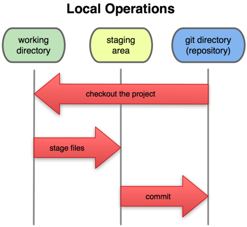

# 使用git文档版本管理工具
## git简介
## git入门
### 告诉git你是谁

如下步骤操作，只需要执行一遍，以后不再需要重复。

    git config --global  user.name "张三"
    git config --global user.email zhangsan@myemail.com
    git config --global core.editor notepad++
    git config --list

创建一个工作目录，如：myWork，执行git初始化，然后在目录中添加需要管理的文件。

    mkdir myWork
    cd myWork
    git init
    copy abc.txt

查看工作区状态

    git status
    
    
    
    
    
编辑.gitignore文件，逐行写上需要忽略掉的不纳入git管理的文件或目录：
    
    *.class
    .project
    .classpath
    .settings/

设置文件停放区（staging area）内容：

如图：

