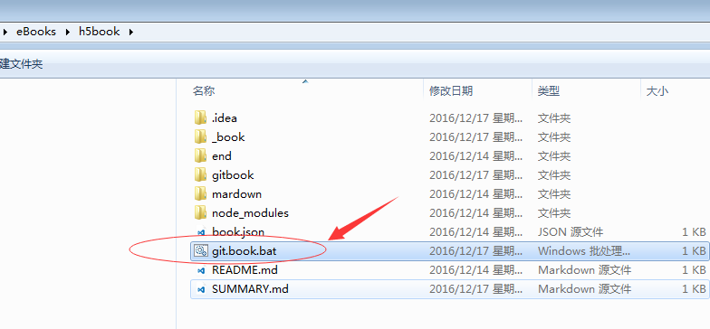

# 第三节 创建图书目录
##1. 创建图书目录描述文件 

图书根目录下有两个重要文件：README.md和SUMMARY.md，其中README.md为图书简介和作者前言之类的内容，SUMMARY.md为是本图书的目录结构描述。

用文本编辑器在图书根目录下创建文件SUMMARY.md，并编辑如下内容：

    # Summary

    * [简介](README.md)
    * [第一章 gitbook的安装](chapter1/README.md) 
        * [第一节 安装npm](chapter1/section1.md)
        * [第二节 安装gitbook](chapter1/section2.md)
        * [第三节 创建图书目录](chapter1/section3.md)
    * [第二章](chapter2/README.md)
        * [第一节](chapter2/section1.md)
        * [第二节](chapter2/section2.md)
    * [结束](end/README.md)

    
##2. 根据SUMMARY.md创建相关文件和目录 

在命令行窗口执行如下命令，gitbook会根据SUMMARY.md文件中描述的图书目录结构，自动创建各个章节的目录和内容文件：

    gitbook init

然后可以用如下命令随时查看已创建的目录和内容文件

    tree . 
    
可以看到每章都有一个目录，目录下还有README.md文件，该文件用于本章内容的简介，每节都有一个md文件，该文件就是本节的具体内容。

##3. 生成图书

gitbook 是一个电子书制作程序；它可以把组织起来的 Markdown 文件按照层次生成电子书；这个电子书的格式可以是 epub、mobi、pdf，甚至还可以是一个网站；

使用gitbook build把书籍生成你需要的格式。

生成静态网站

    gitbook serve --port 4000
    （其中，4000为网站端口号）
    
如果遇到错误，可以如下修正：

    npm config edit
修改prefix变量为`C:\Users\<User Name>\AppData\Roaming\npm`

    
浏览器中输入 `http://localhost:4000` 就可以预览刚才生成的以网页形式组织的书籍。这里你会发现，你的图书项目的目录中多了一个名为_book的文件目录，而这个目录中的文件，即是生成的静态网站内容。

我习惯于在图书根目录下建立一个名为git.book.bat的windows批处理文件（你也可以换作其他的文件名字），以后可以用鼠标双击该文件即可快速启动图书的静态网站。其中内容如下：

    gitbook serve --port 4000
    pause
如下图所示：
    
    
    